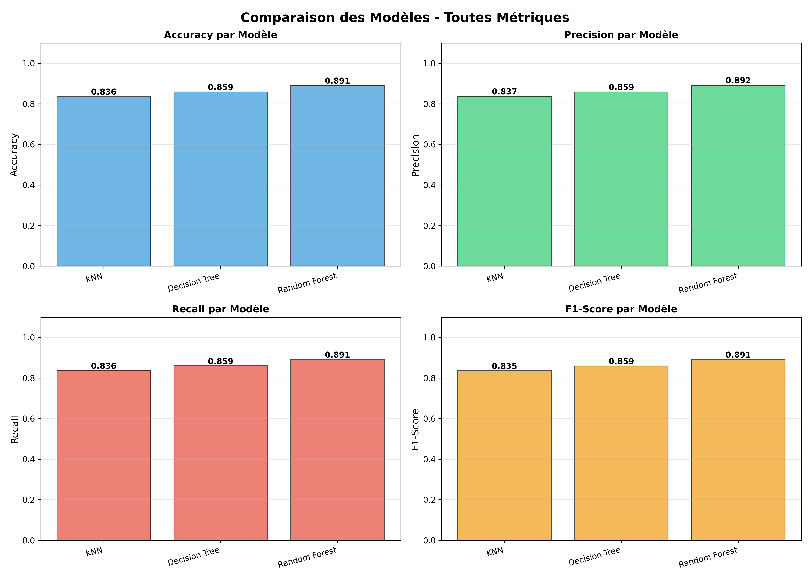
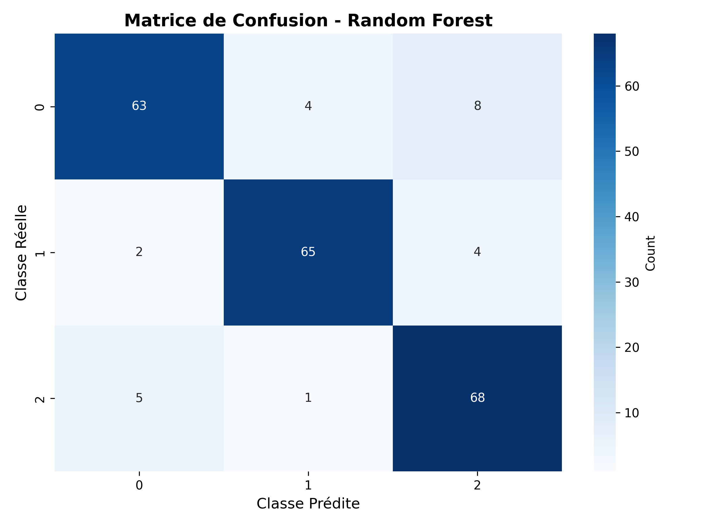

# Prédiction du Niveau de Stress Étudiant par Machine Learning

## 📋 Vue d'Ensemble

Ce projet académique développe un système de classification pour prédire le niveau de stress des étudiants (faible, modéré, élevé) à partir de 20 variables psychologiques, physiologiques, environnementales, académiques et sociales.

**Objectif :** Identifier le modèle de classification optimal et démontrer l'importance d'un preprocessing de qualité dans la stabilité des résultats.

**Meilleur modèle :** Random Forest (F1-Score = 89.1%, ROC-AUC = 95%)

---

## 📊 Dataset

### Caractéristiques Générales
- **Source :** StressLevelDataset.csv
- **Taille :** 1100 observations × 21 variables
- **Variable cible :** `stress_level` (3 classes équilibrées : 0=Faible, 1=Modéré, 2=Élevé)
- **Qualité :** Aucune valeur manquante, aucun doublon

### Variables Prédictives (20 features)

| Dimension | Variables |
|-----------|-----------|
| **Psychologique** | Anxiété, estime de soi, dépression, historique de santé mentale |
| **Physiologique** | Maux de tête, pression artérielle, qualité du sommeil, problèmes respiratoires |
| **Environnementale** | Niveau de bruit, conditions de logement, sécurité, satisfaction des besoins |
| **Académique** | Résultats académiques, charge de travail, relation enseignant-étudiant, inquiétudes professionnelles |
| **Sociale** | Support social, pression des pairs, activités extrascolaires, expérience de harcèlement |

---

## 🤖 Modèles de Classification

### 1. K-Nearest Neighbors (KNN)
- **Paradigme :** Classification par proximité
- **Paramètres :** k=5 voisins, distance euclidienne
- **Avantages :** Simplicité, absence d'hypothèses distributionnelles
- **Limites :** Sensible à l'échelle des variables

### 2. Decision Tree (Arbre de Décision)
- **Paradigme :** Apprentissage de règles if-then
- **Paramètres :** Profondeur max=10, critère de Gini
- **Avantages :** Très interprétable, gère les interactions
- **Limites :** Tendance au surapprentissage

### 3. Random Forest (Forêt Aléatoire)
- **Paradigme :** Méthode d'ensemble (bagging)
- **Paramètres :** 100 arbres, bootstrap activé
- **Avantages :** Robuste, réduit la variance
- **Limites :** Moins interprétable, plus coûteux

---

## 📈 Résultats

### Performances Comparatives

| Modèle | Accuracy | Precision | Recall | F1-Score | ROC-AUC |
|--------|----------|-----------|--------|----------|---------|
| **KNN** | 83.6% | 83.7% | 83.6% | 83.5% | ~92% |
| **Decision Tree** | 85.9% | 85.9% | 85.9% | 85.9% | ~91% |
| **Random Forest** | **89.1%** | **89.2%** | **89.1%** | **89.1%** | **~95%** |

<p align="center">
  
</p>

### Analyse des Résultats

#### ✅ Convergence des Performances (écart <3%)

Cette **proximité des résultats** est un **indicateur positif** qui s'explique par :

1. **Dataset de haute qualité** - Données propres, cohérentes, sans bruit significatif
2. **Preprocessing optimal** - Normalisation StandardScaler et stratification efficaces
3. **Features hautement informatives** - Corrélations fortes (anxiété: r>0.6, sommeil: r<-0.5)
4. **Problème bien défini** - Classes clairement séparables dans l'espace des features

#### 🎯 Validation Méthodologique

✓ **Robustesse cross-modèles** - Résultats reproductibles avec 3 paradigmes différents  
✓ **Fiabilité production** - Modèle déployable avec >85% de confiance  
✓ **Dataset production-ready** - Exploitable sans retraitement intensif  
✓ **Rigueur scientifique** - Convergence renforçant la validité des conclusions

### Matrice de Confusion (Random Forest)

<p align="center">
  
</p>

---

## 🔄 Pipeline de Traitement

### Phase 1 : Analyse Exploratoire (EDA)

**Objectif :** Comprendre la structure et les relations entre variables

**Opérations :**
- Statistiques descriptives complètes
- Analyse de l'équilibre des classes
- Matrice de corrélation (21×21)
- Visualisations des distributions
- Comparaisons par niveau de stress

**Sorties :** 6 fichiers dans `results/eda/`

---

### Phase 2 : Prétraitement

**Objectif :** Préparer les données pour l'apprentissage

**Opérations :**
- **Nettoyage** - Détection valeurs manquantes/doublons
- **Encodage** - Transformation cible en numérique (0, 1, 2)
- **Normalisation** - StandardScaler (μ=0, σ=1)
- **Stratification** - Split 80/20 avec préservation des classes

**Sorties :** `scaler.pkl`, `label_encoder.pkl` dans `results/models/`

---

### Phase 3 : Modélisation et Évaluation

**Métriques d'évaluation :**

| Métrique | Formule | Interprétation |
|----------|---------|----------------|
| **Accuracy** | (VP + VN) / Total | Pourcentage global de bonnes prédictions |
| **Precision** | VP / (VP + FP) | Proportion de prédictions positives correctes |
| **Recall** | VP / (VP + FN) | Proportion de vrais positifs détectés |
| **F1-Score** | 2 × (P × R) / (P + R) | Moyenne harmonique (métrique principale) |
| **ROC-AUC** | Aire sous courbe ROC | Capacité de discrimination globale |

**Critère de sélection :** Le **F1-Score** est utilisé comme métrique principale car il offre un équilibre optimal entre precision et recall, crucial pour l'accompagnement étudiant.

## 📝 Intégration pipline de MLFlow

MLflow est utilisé pour suivre les expériences de machine learning, comparer les modèles
et versionner les modèles entraînés.

### Interface MLflow UI  permet de :

📊 Visualiser toutes les expériences en un coup d'œil

📈 Comparer les performances des modèles (graphiques interactifs)

🔍 Explorer les hyperparamètres de chaque run

💾 Télécharger les modèles sauvegardés

📝 Ajouter des notes et tags pour organiser vos expériences

🔄 Revenir à des versions antérieures de modèles

### 🔹 Vue générale des expérimentations
<p align="center">
  
</p>

### 🔹 Détails du meilleur modèle (Random Forest)
<p align="center">
  
</p>

### 🔹 Comparaison les métriques des modèles
<p align="center">
  
</p>

### 🔹 Statu des différents modèles
<p align="center">
  
</p>


---

## 📂 Structure des Résultats

```
stressLevelDetection_DataMining/
├── 📁 data/
│   └── StressLevelDataset.csv              # Dataset source (1100×21)
│
├── 📁 src/
│   ├── main.py                             # Pipeline principal standard
│ 
│   ├── eda.py                              # Analyse exploratoire
│   ├── preprocessing.py                    # Prétraitement des données
│   ├── modeling.py                         # Entraînement des modèles
│   
│
├── 📁 results/
│   ├── 📁 eda/
│   │   ├── stress_distribution.png         # Distribution des 3 classes
│   │   ├── correlation_matrix.png          # Heatmap de corrélation 21×21
│   │   ├── stress_correlations.png         # Top 10 corrélations avec stress
│   │   ├── features_distribution.png       # Histogrammes des features clés
│   │   ├── features_by_stress.png          # Boxplots comparatifs par classe
│   │   └── statistics_summary.txt          # Rapport statistique détaillé
│   │
│   ├── confusion_matrix_KNN.png            # Matrice de confusion KNN
│   ├── confusion_matrix_Decision_Tree.png  # Matrice de confusion Decision Tree
│   ├── confusion_matrix_Random_Forest.png  # Matrice de confusion Random Forest
│   ├── metrics_comparison.png              # Graphique comparatif en barres
│   ├── radar_comparison.png                # Vue radar des performances
│   ├── metrics_comparison.csv              # Données tabulaires (export)
│   └── evaluation_report.txt               # Rapport d'évaluation complet
│
├── 📁 models/
│   ├── KNN.pkl                             # Modèle KNN entraîné
│   ├── Decision_Tree.pkl                   # Modèle Decision Tree entraîné
│   ├── Random_Forest.pkl                   # Modèle Random Forest (meilleur)
│   ├── scaler.pkl                          # StandardScaler (réutilisable)
│   ├── label_encoder.pkl                   # LabelEncoder (réutilisable)
│   └── training_report.txt                 # Rapport d'entraînement MLflow
│
├── 📁 mlruns/                              # Dossier MLflow (généré automatiquement)
│   └── <experiment_id>/
│       └── <run_id>/
│           ├── metrics/                    # Métriques enregistrées
│           ├── params/                     # Hyperparamètres
│           ├── artifacts/                  # Modèles et graphiques
│           └── tags/                       # Métadonnées
│
├── 📁 mlflow/                              # Captures d'écran MLflow UI
│   ├── capture 1.png
│   ├── capture 2.png
│   └── screencapture-*.png
│
├─                     
│ 
│
├── requirements.txt                        # Dépendances Python
├── README.md                               # Documentation complète
└── .gitignore                              # Fichiers à ignorer (venv, mlruns, etc.)


```
---

## 🚀 Installation et Exécution

### Prérequis
-Python 3.10 ou supérieur

-pip (gestionnaire de paquets Python)

-2 GB d'espace disque disponible

-Navigateur web (pour MLflow UI)

### Installation

```bash
# 1. Cloner le projet
git clone https://github.com/HelaHamza/stressLevelDetection_DataMining.git
cd stressLevelDetection_DataMining

# 2. Créer l'environnement virtuel
python -m venv venv

# Windows
venv\Scripts\activate

# Linux/Mac
source venv/bin/activate

# 3. Installer les dépendances
pip install -r requirements.txt
```

### Exécution
Le projet propose deux modes d'exécution  :

### Option 1 : Pipeline Standard 📊
Exécution simple avec génération de visualisations et rapports :

```bash
python src/main.py
```
Résultats générés :

-13 fichiers de visualisations (graphiques PNG, matrices de confusion)

-Modèles entraînés sauvegardés dans models/

-Rapport d'évaluation détaillé

-Métriques exportées en CSV

### Option 2 : Pipeline avec MLflow (Recommandé) 🚀
Pour un tracking complet des expériences avec interface interactive :

#### Terminal 1 : Lancer l'entraînement avec MLflow
```bash
python src/train_with_mlflow.py # Cette commande crée les expériences MLflow et stocke tous les résultats de l’entraînement (Entraîne le modèle et enregistre les résultats).
```


#### Terminal 2 : Lancer l'interface MLflow UI (dans une nouvelle fenêtre)
```bash
mlflow ui ==> Cette commande permet de visualiser et analyser les résultats enregistrés par la première commande (Affiche graphiquement ces résultats).
```
#### Accès à l'interface MLflow : 
http://localhost:5000  


- Fonctionnalités disponibles dans l'interface :

📊 Tableau de bord avec tous les runs

📈 Graphiques comparatifs interactifs

🔍 Détails complets de chaque expérimentation

💾 Téléchargement des modèles et artifacts

🏷️ Ajout de tags et notes

🔄 Gestion du versioning des modèles


---

## 🛠️ Technologies

- **Python 3.10** - Langage principal
- **scikit-learn 1.2+** - Algorithmes ML et métriques
- **pandas** - Manipulation de données
- **NumPy** - Calculs numériques
- **Matplotlib/Seaborn** - Visualisations
- **joblib** - Persistance des modèles
- **mlflow** - Tracking, versioning et déploiement

---


## 📝 Conclusions

Ce projet démontre qu'un preprocessing de qualité et un dataset bien structuré permettent d'obtenir des performances élevées (>85%) avec des algorithmes variés. La **convergence des résultats** entre trois paradigmes différents valide la robustesse méthodologique et la fiabilité du système de prédiction.

Le **Random Forest** (89.1% F1-Score) se distingue comme le modèle optimal pour un déploiement en production, offrant le meilleur compromis entre performance et généralisation.

---

## 👤 Auteur

**Hala Hamza**  
Projet Data Mining - Année Académique 2024/2025
